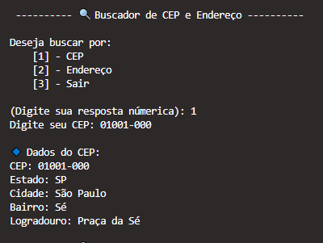
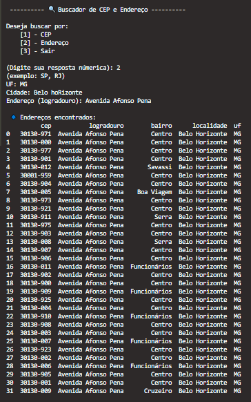

# Buscador de CEP e Endereço

Este projeto em Python permite realizar buscas de CEP e Endereços utilizando a API pública do [ViaCEP](https://viacep.com.br). Ele oferece a funcionalidade de buscar dados a partir de um CEP ou realizar uma busca por estado, cidade e endereço (logradouro).

## Funcionalidades

- **Buscar CEP:** Ao fornecer um CEP válido, o programa retorna as informações sobre o endereço, como cidade, estado, bairro e logradouro.
- **Buscar Endereço:** Ao fornecer o estado (UF), cidade e logradouro, o programa retorna uma lista de endereços encontrados, com os respectivos CEPs.

## Exemplo de Busca por CEP

Aqui está um exemplo com o endereço encontrado através de um CEP:



## Exemplo de Busca por Endereço

Ao buscar um endereço (com UF, cidade e logradouro), o programa retorna uma lista de CEPs encontrados que correspondem ao endereço informado. Aqui está um exemplo do funcionamento da busca por endereço, onde o sistema retorna múltiplos CEPs com os respectivos logradouros, bairros e cidades.



## Tecnologias Utilizadas

- **Python 3.13**
- **Bibliotecas:** 
  - `requests`: Para fazer as requisições HTTP à API do ViaCEP.
  - `pandas`: Para organizar e exibir os dados de forma tabular.
  - `unicodedata`: Para remover acentos dos textos de entrada.

## Dependências

- **requests**: Para fazer requisições HTTP.
- **pandas**: Para exibir os resultados em formato de tabela.
- **unicodedata**: Para remover acentos de texto.

## Como Usar

1. Clone ou faça o download deste repositório para sua máquina local:

    ```bash
    git clone https://github.com/SabrinaGamaa/Cep.git
    ```

2. Antes de rodar o projeto, instale as dependências utilizando o arquivo `requirements.txt`:

    ```bash
    pip install -r requirements.txt
    ```

3. Execute o código:

    ```bash
    python nome_do_arquivo.py
    ```

4. Escolha a opção desejada para buscar um CEP ou endereço.

## Exemplo de Código

Aqui está um trecho do código que você pode usar para buscar CEP e endereços:

```python
import requests
import json
import pandas as pd
import unicodedata

UF_VALIDAS = [
    "AC", "AL", "AP", "AM", "BA", "CE", "DF", "ES", "GO", "MA", "MT",
    "MS", "MG", "PA", "PB", "PR", "PE", "PI", "RJ", "RN", "RS", "RO",
    "RR", "SC", "SP", "SE", "TO"
]

def remover_acentos(texto):
    # Vou remover acentos especiais
    return ''.join(c for c in unicodedata.normalize('NFKD', texto) if not unicodedata.combining(c))

def buscar_cep(cep):
    cep = cep.replace("-", "").replace(".", "").strip()
    
    if len(cep) == 8 and cep.isdigit():
        link = f"https://viacep.com.br/ws/{cep}/json/"
        try:
            resposta = requests.get(link, timeout=5)
            resposta.raise_for_status()

            dados = resposta.json()        
            if "erro" not in dados:
                print("\n🔹 Dados do CEP: ")
                print(f"CEP: {dados['cep']} ")
                print(f"Estado: {dados['uf']} ")
                print(f"Cidade: {dados['localidade']} ")
                print(f"Bairro: {dados['bairro']} ")
                print(f"Logradouro: {dados['logradouro']} ")
            else:
                print("❌ CEP não encontrado.")
        except requests.exceptions.RequestException:
            print("❌ Erro de conexão. Por favor, verifique sua internet.")
    else:
        print("❌ CEP inválido. Digite apenas 8 números.")


def buscar_endereco(uf:str, cidade:str, endereco:str):
    uf = uf.upper().strip()

    if uf not in UF_VALIDAS:
        print(f"❌ UF inválida. Digite um estado válido (exemplo: SP, RJ, MG).")
        return
    
    cidade = remover_acentos(cidade.strip())
    endereco = remover_acentos(endereco.strip())

    link = f"https://viacep.com.br/ws/{uf}/{cidade}/{endereco}/json/"
    try:
        resposta = requests.get(link, timeout=5)
        resposta.raise_for_status()
        dados = resposta.json()

        if isinstance(dados, list) and len(dados) > 0:
            print(f"\n 🔹 Endereços encontrados: ")

            tabela = pd.DataFrame(dados)
            print(tabela[["cep", "logradouro", "bairro", "localidade", "uf"]])
        else:
            print("❌ Nenhum endereço encontrado.")
    except requests.exceptions.RequestException:
        print("❌ Erro de conexão. ")
